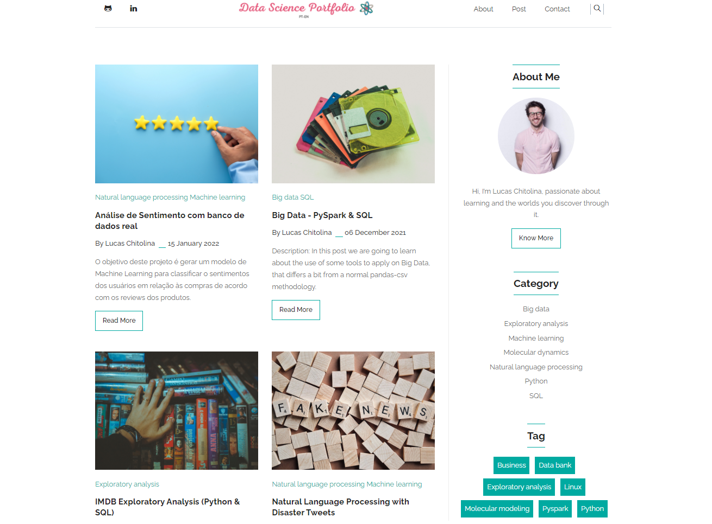

<h1 align=center><a target="_blank" href="https://demo.gethugothemes.com/liva" rel="nofollow">Data Science Portfolio</a> <a  target="_blank" href="https://lighthouse-dot-webdotdevsite.appspot.com//lh/html?url=https%3A%2F%2Fdemo.gethugothemes.com%2Fliva%2F">🌠</a></h1>

This is my second, ~~and now main~~, site/portfolio, created through Hugo framework and using Liva theme by "ThemeFisher".  
If this kind of project got your interest, I teach you how to prepare your own Site on this repo: https://github.com/Chitolina/CreatingYourSiteGuide  
I hope you enjoy it ;)  

