```python
import pandas as pd
import numpy as np
import matplotlib.pyplot as plt
import seaborn as sns
sns.set_style("whitegrid", {"axes.facecolor": ".9"}) 

#import os

#from functools import reduce
from pmdarima import auto_arima


from sklearn.cluster import KMeans

#import urllib
#from io import BytesIO 
#import requests

import warnings
warnings.filterwarnings('ignore')
```


```python
df = pd.read_csv("full_data_cleaned.csv")
print("Printando algumas colunas")
df_c = print(df.iloc[:, 2:7])

#first_n_columns = df[df.columns[:6]]
```

    Printando algumas colunas
           order_status order_purchase_timestamp    order_approved_at  \
    0         delivered      2017-10-02 10:56:33  2017-10-02 11:07:15   
    1         delivered      2017-10-02 10:56:33  2017-10-02 11:07:15   
    2         delivered      2017-10-02 10:56:33  2017-10-02 11:07:15   
    3         delivered      2017-08-15 18:29:31  2017-08-15 20:05:16   
    4         delivered      2017-08-02 18:24:47  2017-08-02 18:43:15   
    ...             ...                      ...                  ...   
    113211    delivered      2018-08-10 21:14:35  2018-08-10 21:25:22   
    113212    delivered      2018-07-01 10:23:10  2018-07-05 16:17:52   
    113213    delivered      2018-07-24 09:46:27  2018-07-24 11:24:27   
    113214    delivered      2018-05-22 21:13:21  2018-05-22 21:35:40   
    113215    delivered      2018-05-15 17:41:00  2018-05-16 03:35:29   
    
           order_delivered_carrier_date order_delivered_customer_date  
    0               2017-10-04 19:55:00           2017-10-10 21:25:13  
    1               2017-10-04 19:55:00           2017-10-10 21:25:13  
    2               2017-10-04 19:55:00           2017-10-10 21:25:13  
    3               2017-08-17 15:28:33           2017-08-18 14:44:43  
    4               2017-08-04 17:35:43           2017-08-07 18:30:01  
    ...                             ...                           ...  
    113211          2018-08-13 13:54:00           2018-08-21 04:16:31  
    113212          2018-07-04 14:34:00           2018-07-09 15:06:57  
    113213          2018-07-24 15:14:00           2018-08-02 22:47:35  
    113214          2018-05-24 12:28:00           2018-06-12 23:11:29  
    113215          2018-05-16 17:20:00           2018-05-21 14:31:41  
    
    [113216 rows x 5 columns]
    


```python
df.info()
```

    <class 'pandas.core.frame.DataFrame'>
    RangeIndex: 113216 entries, 0 to 113215
    Data columns (total 39 columns):
     #   Column                         Non-Null Count   Dtype  
    ---  ------                         --------------   -----  
     0   order_id                       113216 non-null  object 
     1   customer_id                    113216 non-null  object 
     2   order_status                   113216 non-null  object 
     3   order_purchase_timestamp       113216 non-null  object 
     4   order_approved_at              113216 non-null  object 
     5   order_delivered_carrier_date   113216 non-null  object 
     6   order_delivered_customer_date  113216 non-null  object 
     7   order_estimated_delivery_date  113216 non-null  object 
     8   order_item_id                  113216 non-null  float64
     9   product_id                     113216 non-null  object 
     10  seller_id                      113216 non-null  object 
     11  shipping_limit_date            113216 non-null  object 
     12  price                          113216 non-null  float64
     13  freight_value                  113216 non-null  float64
     14  payment_sequential             113216 non-null  float64
     15  payment_type                   113216 non-null  object 
     16  payment_installments           113216 non-null  float64
     17  payment_value                  113216 non-null  float64
     18  review_id                      113216 non-null  object 
     19  review_score                   113216 non-null  float64
     20  review_comment_title           113216 non-null  object 
     21  review_comment_message         113216 non-null  object 
     22  review_creation_date           113216 non-null  object 
     23  review_answer_timestamp        113216 non-null  object 
     24  product_category_name          113216 non-null  object 
     25  product_name_lenght            113216 non-null  float64
     26  product_description_lenght     113216 non-null  float64
     27  product_photos_qty             113216 non-null  float64
     28  product_weight_g               113216 non-null  float64
     29  product_length_cm              113216 non-null  float64
     30  product_height_cm              113216 non-null  float64
     31  product_width_cm               113216 non-null  float64
     32  customer_unique_id             113216 non-null  object 
     33  customer_zip_code_prefix       113216 non-null  int64  
     34  customer_city                  113216 non-null  object 
     35  customer_state                 113216 non-null  object 
     36  seller_zip_code_prefix         113216 non-null  float64
     37  seller_city                    113216 non-null  object 
     38  seller_state                   113216 non-null  object 
    dtypes: float64(15), int64(1), object(23)
    memory usage: 33.7+ MB
    


```python
#Selecting just the useful features for this analysis

data = df[['order_id','customer_id','order_purchase_timestamp','order_approved_at','order_status','order_delivered_carrier_date','order_delivered_customer_date',
        'order_estimated_delivery_date','order_item_id','product_id','price','freight_value','shipping_limit_date',
        'customer_zip_code_prefix','product_name_lenght','product_description_lenght','product_photos_qty','seller_state',
        'product_category_name','customer_city','customer_state','customer_zip_code_prefix','product_name_lenght','product_description_lenght','product_photos_qty']]
```


```python
# De-normalized data - All datasets together, OLAP.
print('columns:', data.columns)
print('shape:', data.shape)
```

    columns: Index(['order_id', 'customer_id', 'order_purchase_timestamp',
           'order_approved_at', 'order_status', 'order_delivered_carrier_date',
           'order_delivered_customer_date', 'order_estimated_delivery_date',
           'order_item_id', 'product_id', 'price', 'freight_value',
           'shipping_limit_date', 'customer_zip_code_prefix',
           'product_name_lenght', 'product_description_lenght',
           'product_photos_qty', 'seller_state', 'product_category_name',
           'customer_city', 'customer_state', 'customer_zip_code_prefix',
           'product_name_lenght', 'product_description_lenght',
           'product_photos_qty'],
          dtype='object')
    shape: (113216, 25)
    

#### EDA - Análise Exploratória de Dados  
> 
Agora que temos todos os dados em um conjunto, vamos para a etapa de análise exploratória para entender melhor o que está em nossas mãos.

* Podemos fazer algumas análises na variável de interesse "price", para começar a entender melhor os dados relacionados à tarefa proposta.


```python
priceGrouped = data.groupby('order_id')['price'].sum()
priceGrouped.describe()
```


    count    94490.000000
    mean       143.625489
    std        236.229765
    min          0.850000
    25%         47.650000
    50%         89.180000
    75%        154.900000
    max      13440.000000
    Name: price, dtype: float64


```python
# Vamos verificar a diferença de valor gerado por cada estado

totalByState = data.groupby('customer_state')['price'].sum().sort_values(ascending=False)

sns.set_theme(style="whitegrid")
plt.figure(figsize=(15,5))
plt.title('Preço Total por Estado')
sns.barplot(x=totalByState.index, y=totalByState)
```


    <AxesSubplot:title={'center':'Preço Total por Estado'}, xlabel='customer_state', ylabel='price'>


    
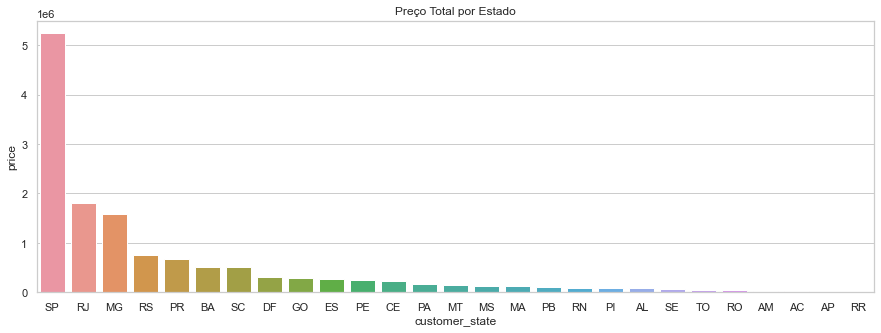
    


```python
# Preço e Pedidos seguem a mesma tendência em relação aos estados com maior atuação no consumo

totalOrdersByState = data.groupby('customer_state')['order_id'].nunique().sort_values(ascending=False)
totalOrdersByState

plt.figure(figsize=(15,5))
plt.title('Ordem total de produtos por Estado')
sns.barplot(x=totalOrdersByState.index, y=totalOrdersByState)
```


    <AxesSubplot:title={'center':'Ordem total de produtos por Estado'}, xlabel='customer_state', ylabel='order_id'>


    
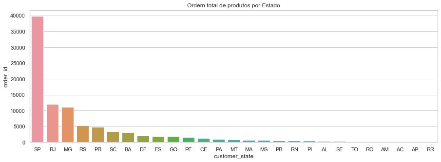
    


Abaixo, também veremos quais estados recebem os vendedores com o maior número de vendas. Também vamos analisar quais estados possuem os maiores valores de frete, tendo em vista a grande extensão territorial do país.


```python
totalSellerByState = data.groupby('seller_state')['order_id'].nunique().sort_values(ascending=False)
totalSellerByState

# Define the plot sizes
fig, ax = plt.subplots(1, figsize = (15,5))
plt.title('Estados que mais vendem')

sq.plot(sizes= totalSellerByState,
        color = ['brown','turquoise','lime','royalblue','wheat','gainsboro','aqua','indigo','sandybrown','pink','dodgerblue'],
        label= totalSellerByState.index,
        alpha = .8)

plt.show()
```


    
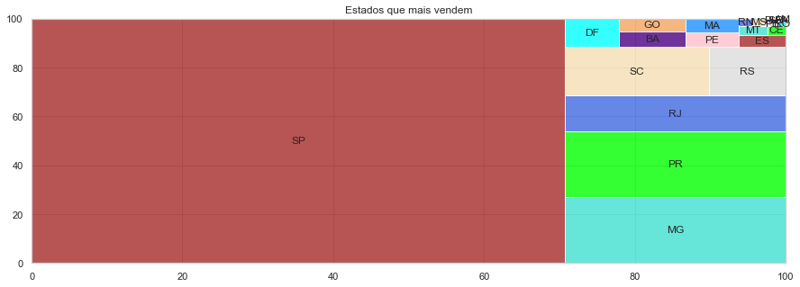
    


```python
freightAvgState = (data.groupby('customer_state')['freight_value'].sum() /data.groupby('customer_state')['order_id'].nunique()).sort_values(ascending=False)


plt.figure(figsize=(15,5))
plt.title('Valor médio do frete em R$ por Estado do Cliente')
sns.barplot(x=freightAvgState.index, y=freightAvgState)
```


    <AxesSubplot:title={'center':'Valor médio do frete em R$ por Estado do Cliente'}, xlabel='customer_state'>


    
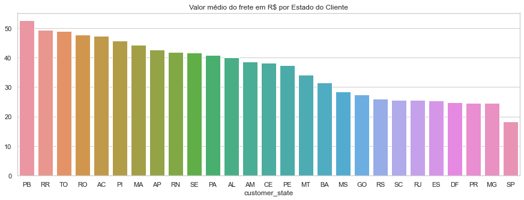
    


Categorias de produtos e avaliações. Aqui vamos verificar quais são os produtos com mais compras.


```python
productCategoryOrders = data['product_category_name'].value_counts().head(10)

plt.figure(figsize=(15,8))
plt.title('As 10 principais categorias de produtos com mais pedidos')
sns.barplot(y=productCategoryOrders.index, x=productCategoryOrders, orient='h')
```


    <AxesSubplot:title={'center':'As 10 principais categorias de produtos com mais pedidos'}, xlabel='product_category_name'>


    
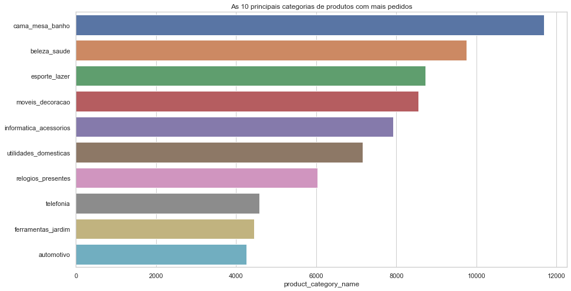
    


Apesar de fazermos algumas análises que nos mostram alguns insights, o que a tarefa nos pede é uma relação de valores por uma medida de tempo. Portanto, precisamos afunilar os dados que iremos usar pra alcançar o objetivo principal.

* Transformando nossos dados temporais em datetime, pois estavam como strings:


```python
data['order_approved_at'] = pd.to_datetime(data['order_approved_at'])
data['order_purchase_timestamp'] = pd.to_datetime(data['order_purchase_timestamp'])
data['order_delivered_carrier_date'] = pd.to_datetime(data['order_delivered_carrier_date'])
data['order_estimated_delivery_date'] = pd.to_datetime(data['order_estimated_delivery_date'])
data['shipping_limit_date'] = pd.to_datetime(data['shipping_limit_date'])
data['order_delivered_carrier_date'] = pd.to_datetime(data['order_delivered_carrier_date'])

print(data['order_approved_at'])
```

    0        2017-10-02 11:07:15
    1        2017-10-02 11:07:15
    2        2017-10-02 11:07:15
    3        2017-08-15 20:05:16
    4        2017-08-02 18:43:15
                     ...        
    113211   2018-08-10 21:25:22
    113212   2018-07-05 16:17:52
    113213   2018-07-24 11:24:27
    113214   2018-05-22 21:35:40
    113215   2018-05-16 03:35:29
    Name: order_approved_at, Length: 113216, dtype: datetime64[ns]
    


Previsão de série temporal (soma dos números de vendas) para prever a soma do valor de vendas para as próximas semanas.  


```python
data['price'] = data['price'].apply(int) # round instead of int is you prefer to round
print(data['price'].head(15).to_markdown())
```

    |    |   price |
    |---:|--------:|
    |  0 |      29 |
    |  1 |      29 |
    |  2 |      29 |
    |  3 |      29 |
    |  4 |      29 |
    |  5 |      29 |
    |  6 |      75 |
    |  7 |      75 |
    |  8 |      75 |
    |  9 |      75 |
    | 10 |      75 |
    | 11 |      44 |
    | 12 |      44 |
    | 13 |      44 |
    | 14 |      44 |
    


```python
all_dates = data['order_purchase_timestamp'].dt.date.sort_values().reset_index(drop=True)

miss_data = pd.date_range(start=all_dates.iloc[0], end=all_dates.iloc[-1]).difference(all_dates)
print(f'Total de dados faltantes: {len(miss_data)}')
print(miss_data)
```

    Total de dados faltantes: 85
    DatetimeIndex(['2016-10-11', '2016-10-12', '2016-10-13', '2016-10-14',
                   '2016-10-15', '2016-10-16', '2016-10-17', '2016-10-18',
                   '2016-10-19', '2016-10-20', '2016-10-21', '2016-10-22',
                   '2016-10-23', '2016-10-24', '2016-10-25', '2016-10-26',
                   '2016-10-27', '2016-10-28', '2016-10-29', '2016-10-30',
                   '2016-10-31', '2016-11-01', '2016-11-02', '2016-11-03',
                   '2016-11-04', '2016-11-05', '2016-11-06', '2016-11-07',
                   '2016-11-08', '2016-11-09', '2016-11-10', '2016-11-11',
                   '2016-11-12', '2016-11-13', '2016-11-14', '2016-11-15',
                   '2016-11-16', '2016-11-17', '2016-11-18', '2016-11-19',
                   '2016-11-20', '2016-11-21', '2016-11-22', '2016-11-23',
                   '2016-11-24', '2016-11-25', '2016-11-26', '2016-11-27',
                   '2016-11-28', '2016-11-29', '2016-11-30', '2016-12-01',
                   '2016-12-02', '2016-12-03', '2016-12-04', '2016-12-05',
                   '2016-12-06', '2016-12-07', '2016-12-08', '2016-12-09',
                   '2016-12-10', '2016-12-11', '2016-12-12', '2016-12-13',
                   '2016-12-14', '2016-12-15', '2016-12-16', '2016-12-17',
                   '2016-12-18', '2016-12-19', '2016-12-20', '2016-12-21',
                   '2016-12-22', '2016-12-24', '2016-12-25', '2016-12-26',
                   '2016-12-27', '2016-12-28', '2016-12-29', '2016-12-30',
                   '2016-12-31', '2017-01-01', '2017-01-02', '2017-01-03',
                   '2017-01-04'],
                  dtype='datetime64[ns]', freq=None)
    


```python
# Descartando os dados anteriores à 2017-01-04
print(f'Último dado faltante {miss_data[-1]}')
data= data[data['order_purchase_timestamp'] >= miss_data[-1]]
```

    Último dado faltante 2017-01-04 00:00:00
    


```python
data.groupby([data['order_purchase_timestamp'].dt.date])['order_status'].count().plot(figsize=(20, 6), color="teal")
plt.title('Total do número de vendas ao longo do tempo diário')
plt.ylabel('Número de Vendas')
plt.xlabel('Data');
```


    
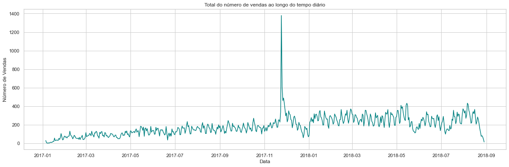
    


```python
max_value = str(data.groupby([data['order_purchase_timestamp'].dt.date])['order_status'].count().idxmax())
print(f'Pico de vendas no dia {max_value}. Black Friday?')
```

    Pico de vendas no dia 2017-11-24. Black Friday?
    


```python
#So the date column has to be converted into the index

data.round()
dataTime = data[['order_id', 'order_purchase_timestamp', 'price']].set_index('order_purchase_timestamp', inplace=False)
#dataTime.drop(dataTime.tail(5).index, inplace=True)

dataTimeMean = pd.DataFrame(dataTime.resample('W')['price'].sum()) #resample using weeks as parameter#plot
dataTimeMean.drop(dataTimeMean.tail(1).index, inplace=True) # Dropar a última semana que só tinha poucos dados, virando um outlier

print(dataTimeMean.tail(10).to_markdown())
```

    | order_purchase_timestamp   |   price |
    |:---------------------------|--------:|
    | 2018-06-24 00:00:00        |  196529 |
    | 2018-07-01 00:00:00        |  192976 |
    | 2018-07-08 00:00:00        |  156328 |
    | 2018-07-15 00:00:00        |  157923 |
    | 2018-07-22 00:00:00        |  223229 |
    | 2018-07-29 00:00:00        |  234745 |
    | 2018-08-05 00:00:00        |  277568 |
    | 2018-08-12 00:00:00        |  276319 |
    | 2018-08-19 00:00:00        |  248918 |
    | 2018-08-26 00:00:00        |  126317 |
    

Às vezes, precisamos avançar ou retroceder com uma certa quantidade de etapas de tempo, isso é chamado de mudança de tempo. O método shift() ajuda a fazer isso. Leva o "período" como argumento, que é o número (nº) de períodos com os quais queremos mudar. Portanto, se mencionarmos o período como 1, os valores das linhas serão deslocados um para baixo.


```python
dataTimeMean['x1'] = dataTimeMean.price.shift(1)

dataTimeMean.dropna(axis=0, inplace=True)

dataTimeMean['x1']  = dataTimeMean['x1'].apply(int)

print(dataTimeMean.head(10).to_markdown())
```

    | order_purchase_timestamp   |   price |    x1 |
    |:---------------------------|--------:|------:|
    | 2017-01-15 00:00:00        |   11054 |  5624 |
    | 2017-01-22 00:00:00        |   23576 | 11054 |
    | 2017-01-29 00:00:00        |   54941 | 23576 |
    | 2017-02-05 00:00:00        |   65293 | 54941 |
    | 2017-02-12 00:00:00        |   76892 | 65293 |
    | 2017-02-19 00:00:00        |   51507 | 76892 |
    | 2017-02-26 00:00:00        |   44642 | 51507 |
    | 2017-03-05 00:00:00        |   66674 | 44642 |
    | 2017-03-12 00:00:00        |   76416 | 66674 |
    | 2017-03-19 00:00:00        |  100858 | 76416 |
    

### **Tornando a série estacionária**

Mas por que uma série temporal tem que ser estacionária?

A estacionaridade é um tipo de estrutura de dependência. Deste modo, enquanto a independência é uma propriedade única, a dependência pode se relacionar de várias maneiras. Assim, a estacionaridade é uma forma de modelar a estrutura de dependência. Muitos dados podem ser considerados estacionários, como séries temporais relacionadas a um aumento de preço, por exemplo; então o conceito de estacionaridade é muito importante na modelagem de dados não independentes.

Quando determinamos que temos estacionariedade, naturalmente queremos modelá-la. É aqui que entram os modelos ARMA (AutoRegressive Moving Average), estes modelos ARMA são muito populares e para sua aplicação precisamos garantir que feature de estudo seja estacionária.

O modelo ARIMA (AutoRegressive Integrated Moving Average) é um modelo para não estacionaridade. Ele assume que os dados se tornam estacionários após a diferenciação.
No contexto de regressão, a estacionaridade é importante, pois os mesmos resultados que se aplicam a dados independentes são válidos se os dados forem estacionários.


```python
# diff(periods=1, axis=0)
# Primeira diferença discreta de elemento:
# calcula a diferença de um elemento Dataframe comparado com outro elemento no Dataframe (o padrão é elemento na linha anterior).

pd.set_option('display.max_columns', 50)
pd.set_option('display.max_rows', 200)
dataTimeMean.price.diff(1).plot(figsize=(20, 6), color="teal")
```


    <AxesSubplot:xlabel='order_purchase_timestamp'>


    
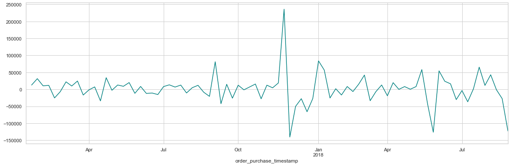
    


```python
dataTimeMean.price.diff(1).groupby(dataTimeMean.index.month).mean().plot(kind='bar', figsize=(10, 6))
```


    <AxesSubplot:xlabel='order_purchase_timestamp'>


    
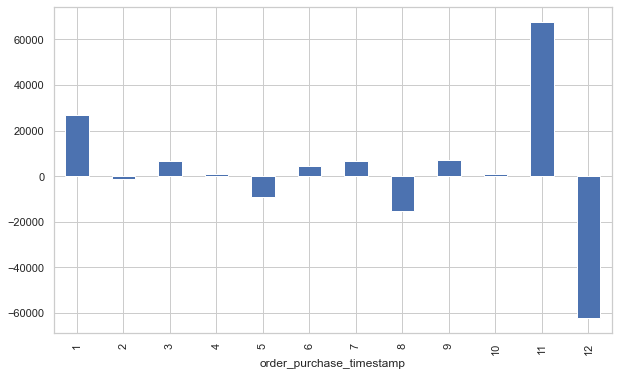
    


Decompondo os dados, notamos uma forte tendência de queda nos valores de acordo com a sazonalidade, ao final de cada ano, em dezembro, provavelmente após uma alta provocada pela Black Friday.  
> 
Vamos investigar o fator de autocorrelação para entender melhor quais parâmetros devemos utilizar: 
* Percebemos então uma forte tendência de queda nos valores de acordo com a sazonalidade, ao final de cada ano.


```python
from statsmodels.graphics.tsaplots import plot_acf, plot_pacf

plot_acf(dataTimeMean.price)
plt.show()
```


    
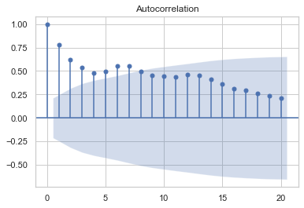
    


```python
plot_pacf(dataTimeMean.price, lags=10)
plt.show()
```


    
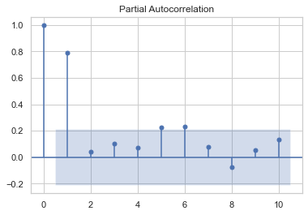
    


Conforme observado no gráfico de Autocorrelação Parcial, um deslocamento de 1 será suficiente para um modelo de regressão.   
Então, vamos criar uma nova variável para aplicar um modelo de regressão para prever o preço das próximas semanas.

#### **Podemos testar alguns modelos de Regressão**

Quando você precisa de regressão?  
> 
Normalmente, você precisa de regressão para responder se e/ou como um fenômeno influencia outro, ou como várias variáveis ​​estão relacionadas.   Por exemplo, você pode usá-lo para determinar se e até que ponto a experiência ou o gênero impactam os salários.

A regressão também é útil quando você deseja prever uma resposta usando um novo conjunto de preditores. Por exemplo, você pode tentar prever o consumo de eletricidade de uma casa para a próxima hora, considerando a temperatura externa, a hora do dia e o número de moradores dessa casa.

#### **Regressão linear**

A regressão linear é provavelmente uma das técnicas de regressão mais importantes e amplamente utilizadas. Está entre os métodos de regressão mais simples. 
Uma de suas principais vantagens é a facilidade de interpretação dos resultados.


```python
from sklearn.linear_model import LinearRegression
from sklearn.metrics import mean_squared_error
from sklearn.model_selection import cross_val_score

X = dataTimeMean[['x1']]
y = dataTimeMean.price.values

linearRegression = LinearRegression().fit(X, y)
predictionsLinear = linearRegression.predict(X)

print('RMSE for Linear Regression was: \n', mean_squared_error(y, predictionsLinear, squared=False))
```

    RMSE for Linear Regression was: 
     41724.809150577785
    

#### **XGBRegressor**

Os problemas de modelagem preditiva de regressão envolvem a previsão de um valor numérico, como uma quantia em dólar ou uma altura. 
O XGBoost pode ser usado diretamente para modelagem preditiva de regressão. 
> 
Os conjuntos são construídos a partir de modelos de árvore de decisão. As árvores são adicionadas uma de cada vez ao conjunto e ajustadas para corrigir os erros de previsão feitos pelos modelos anteriores. Este é um tipo de modelo de aprendizado de máquina de conjunto conhecido como boosting.  
>  
Os modelos são ajustados usando uma função de perda diferenciável arbitrária e algoritmo de otimização de gradiente descendente. Isso dá à técnica seu nome, “aumento de gradiente”, pois o gradiente de perda é minimizado à medida que o modelo é ajustado, muito parecido com uma rede neural.


```python
from xgboost import XGBRegressor

xgb = XGBRegressor(n_estimators=150, learning_rate=0.05)
xgb.fit(X, y, 
        early_stopping_rounds=5, 
        eval_set=[(X, y)], 
        verbose=False
)

predictions_XGBoost = xgb.predict(X)

print('RMSE for xgb was: \n', mean_squared_error(y, predictions_XGBoost, squared=False))
```

    RMSE for xgb was: 
     7574.006035663861
    

#### **Random Forest**

Florestas aleatórias ou florestas de decisão aleatória são um método de aprendizado de conjunto para classificação, regressão e outras tarefas que operam construindo uma infinidade de árvores de decisão no tempo de treinamento. Para tarefas de classificação, a saída da floresta aleatória é a classe selecionada pela maioria das árvores. Para tarefas de regressão, a previsão média ou média das árvores individuais é retornada. As florestas de decisão aleatória corrigem o hábito das árvores de decisão de se sobreajustar ao seu conjunto de treinamento. As florestas aleatórias geralmente superam as árvores de decisão, mas sua precisão é menor do que as árvores impulsionadas por gradiente.


```python
from sklearn.ensemble import RandomForestRegressor
randomF = RandomForestRegressor(n_estimators = 500, random_state=0).fit(X, y)

predictions_RandomForest = randomF.predict(X)
print('RMSE for Random Forest was: \n', mean_squared_error(y, predictions_RandomForest, squared=False))
```

    RMSE for Random Forest was: 
     17473.84131700968
    

#### **RMSE (root mean squared error):** ####
* é a medida que calcula "a raiz quadrática média" dos erros entre valores observados (reais) e predições (hipóteses).

Uma característica do RMSE é que os erros (reais - predições) são elevados ao quadrado antes de ter a média calculada. Portanto, pesos diferentes serão atribuídos à soma e, conforme os valores de erros das instâncias aumentam o índice do RMSE aumenta consideravelmente. Ou seja, se houver um outlier no conjunto de dados, seu peso será maior para o cálculo do RMSE e, por conseguinte, prejudicará sua métrica deixando-a maior.

Erros muito pequenos favorecem o RMSE (gráfico de cima) ao passo que, conforme os erros aumentam MAE (outra medida de cálculo de erro) fica menor.

Para erros entre 0 e 1 (altíssima acurácia) temos: RMSE <= MAE (Pouco usual com dados reais)

Conforme os erros aumentam temos: MAE <= RMSE. A presença de outliers no dataset de treino ou teste agrava o aumenta do RMSE.

**Então devo usar a métrica com menor valor?**

A diferença das métricas pode auxiliar no diagnóstico de predições muito ruins ou outliers. Se o RMSE ficar muito maior que MAE então esta suposição deve ser verificada 
(interessante executar as duas métricas juntas).

### **Então, vamos escolher XGB Regressor.**


```python
dataTimeMean['Pred_XGB'] = predictions_XGBoost
dataTimeMean['price'].plot(figsize=(15, 6), color="teal")
dataTimeMean['Pred_XGB'].plot(color="orange")

plt.legend(['Price', 'Pred_XGB'])
plt.grid(color = 'gray', linestyle = '--', linewidth = 0.4)
```


    
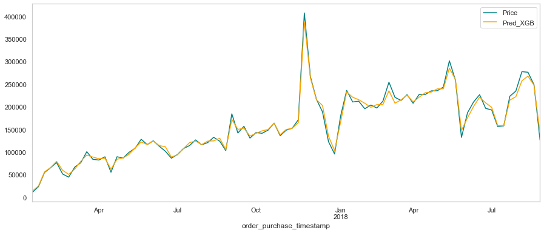
    


```python
print(dataTimeMean.tail(10).to_markdown())
```

    | order_purchase_timestamp   |   price |     x1 |   Pred_XGB |
    |:---------------------------|--------:|-------:|-----------:|
    | 2018-06-24 00:00:00        |  196529 | 226769 |     208692 |
    | 2018-07-01 00:00:00        |  192976 | 196529 |     198725 |
    | 2018-07-08 00:00:00        |  156328 | 192976 |     158536 |
    | 2018-07-15 00:00:00        |  157923 | 156328 |     158767 |
    | 2018-07-22 00:00:00        |  223229 | 157923 |     214770 |
    | 2018-07-29 00:00:00        |  234745 | 223229 |     222216 |
    | 2018-08-05 00:00:00        |  277568 | 234745 |     257377 |
    | 2018-08-12 00:00:00        |  276319 | 277568 |     267742 |
    | 2018-08-19 00:00:00        |  248918 | 276319 |     247696 |
    | 2018-08-26 00:00:00        |  126317 | 248918 |     141411 |
    

Comparando com o RF


```python
dataTimeMean['Pred_RF'] = predictions_RandomForest

dataTimeMean['price'].plot(figsize=(15, 6), color="teal")
dataTimeMean['Pred_RF'].plot(color="black")

plt.legend(['Price', 'Pred_RF'])
plt.grid(color = 'gray', linestyle = '--', linewidth = 0.4)
```


    
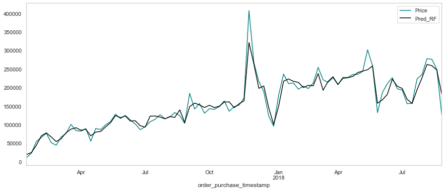
    


```python
print(dataTimeMean.tail(10).to_markdown())
```

    | order_purchase_timestamp   |   price |     x1 |   Pred_XGB |   Pred_RF |
    |:---------------------------|--------:|-------:|-----------:|----------:|
    | 2018-06-24 00:00:00        |  196529 | 226769 |     208692 |    203624 |
    | 2018-07-01 00:00:00        |  192976 | 196529 |     198725 |    197491 |
    | 2018-07-08 00:00:00        |  156328 | 192976 |     158536 |    168473 |
    | 2018-07-15 00:00:00        |  157923 | 156328 |     158767 |    156892 |
    | 2018-07-22 00:00:00        |  223229 | 157923 |     214770 |    193995 |
    | 2018-07-29 00:00:00        |  234745 | 223229 |     222216 |    226039 |
    | 2018-08-05 00:00:00        |  277568 | 234745 |     257377 |    262205 |
    | 2018-08-12 00:00:00        |  276319 | 277568 |     267742 |    258925 |
    | 2018-08-19 00:00:00        |  248918 | 276319 |     247696 |    247197 |
    | 2018-08-26 00:00:00        |  126317 | 248918 |     141411 |    181981 |
    


```python
dataTimeMean = dataTimeMean.drop(columns=['Pred_RF'], axis=0)
dataTimeMean['Pred_XGB']  = dataTimeMean['Pred_XGB'].apply(int)
print(dataTimeMean.tail(10).to_markdown())
```

    | order_purchase_timestamp   |   price |     x1 |   Pred_XGB |
    |:---------------------------|--------:|-------:|-----------:|
    | 2018-06-24 00:00:00        |  196529 | 226769 |     208691 |
    | 2018-07-01 00:00:00        |  192976 | 196529 |     198724 |
    | 2018-07-08 00:00:00        |  156328 | 192976 |     158535 |
    | 2018-07-15 00:00:00        |  157923 | 156328 |     158767 |
    | 2018-07-22 00:00:00        |  223229 | 157923 |     214770 |
    | 2018-07-29 00:00:00        |  234745 | 223229 |     222216 |
    | 2018-08-05 00:00:00        |  277568 | 234745 |     257377 |
    | 2018-08-12 00:00:00        |  276319 | 277568 |     267742 |
    | 2018-08-19 00:00:00        |  248918 | 276319 |     247696 |
    | 2018-08-26 00:00:00        |  126317 | 248918 |     141411 |
    

Dividindo os dados de "montante de $" entre teste e treino


```python
train_size = int(len(dataTimeMean.price) * 2 / 3)

train = X[:train_size]
test = X[train_size-1:]

plt.figure(figsize=(15, 6))
plt.plot(train,color='chocolate')
plt.grid(color = 'gray', linestyle = '--', linewidth = 0.4)
plt.plot(test,color='slateblue')
plt.legend(['train', 'test'])
```


    <matplotlib.legend.Legend at 0x25c98a83070>


    
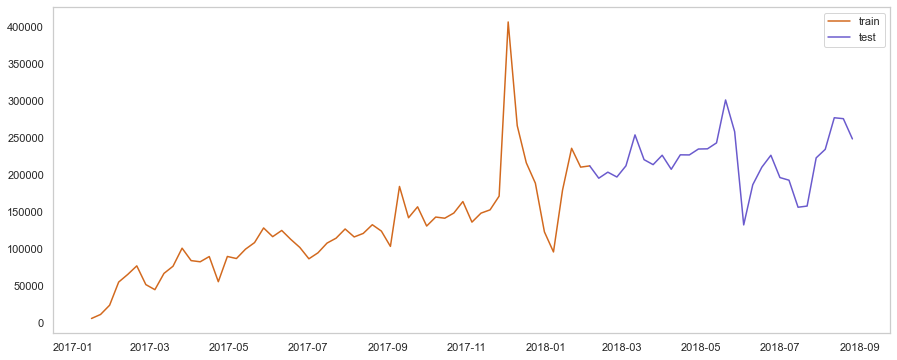
    


Apliocando xgb no teste. Let's see how the model XGB Regressor fits on unseen data (test set)


```python
plt.figure(figsize=(15, 6),linewidth=8)
plt.plot(dataTimeMean.price, color='teal')

forecast = xgb.predict(test)

plt.plot(test.index, forecast,color='crimson')
plt.legend(['Price', 'Predicted'])
plt.grid(color = 'gray', linestyle = '--', linewidth = 0.4)
```


    
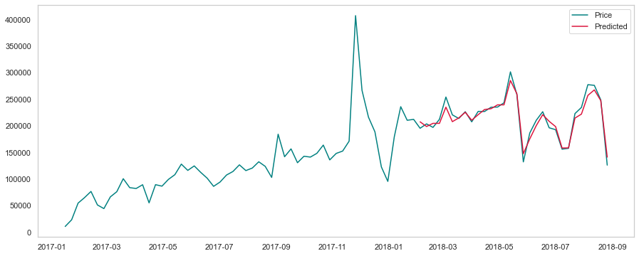
    


Predizendo o montante por semana


```python
lastPrice = dataTimeMean['price'][-1]

datesToPredict = pd.Series(dataTimeMean.index[-1] + pd.Timedelta('1 w'))

forecastData =  pd.DataFrame({'x1': str(lastPrice)}, index=datesToPredict)  
forecastData.x1 = pd.to_numeric(forecastData.x1)

print("Next week's predicted price is: R$", xgb.predict(forecastData))
```

    Next week's predicted price is: R$ [116449.96]
    

Forecasting is a technique that uses historical data as inputs to make informed estimates that are predictive in determining the direction of future trends. 


```python
plt.figure(figsize=(20, 6))
plt.plot(dataTimeMean.price,color='teal')
forecast = xgb.predict(test)
plt.scatter(forecastData.index, xgb.predict(forecastData), color='red')
plt.title("Previsão para a próxima semana")
plt.legend(['Valor atual', 'Previsão'])
plt.grid(color = 'gray', linestyle = '--', linewidth = 0.4)
```


    
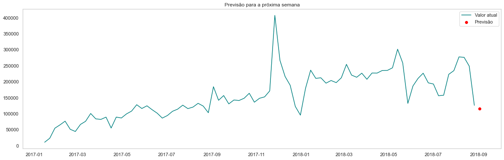
    


```python
#Delete data generated from XGB

dataTimeMean = dataTimeMean.drop(columns=['Pred_XGB', 'x1'], axis=0)
print(dataTimeMean.tail(20).to_markdown())

```

    | order_purchase_timestamp   |   price |
    |:---------------------------|--------:|
    | 2018-04-15 00:00:00        |  227198 |
    | 2018-04-22 00:00:00        |  235203 |
    | 2018-04-29 00:00:00        |  235469 |
    | 2018-05-06 00:00:00        |  243535 |
    | 2018-05-13 00:00:00        |  301666 |
    | 2018-05-20 00:00:00        |  258751 |
    | 2018-05-27 00:00:00        |  132407 |
    | 2018-06-03 00:00:00        |  186805 |
    | 2018-06-10 00:00:00        |  210558 |
    | 2018-06-17 00:00:00        |  226769 |
    | 2018-06-24 00:00:00        |  196529 |
    | 2018-07-01 00:00:00        |  192976 |
    | 2018-07-08 00:00:00        |  156328 |
    | 2018-07-15 00:00:00        |  157923 |
    | 2018-07-22 00:00:00        |  223229 |
    | 2018-07-29 00:00:00        |  234745 |
    | 2018-08-05 00:00:00        |  277568 |
    | 2018-08-12 00:00:00        |  276319 |
    | 2018-08-19 00:00:00        |  248918 |
    | 2018-08-26 00:00:00        |  126317 |
    


```python
train = dataTimeMean[:train_size]
test = dataTimeMean[train_size-1:]

plt.figure(figsize=(15, 6))
plt.plot(train)
plt.plot(test, color="chocolate")
```


    [<matplotlib.lines.Line2D at 0x25cd31d2250>]


    
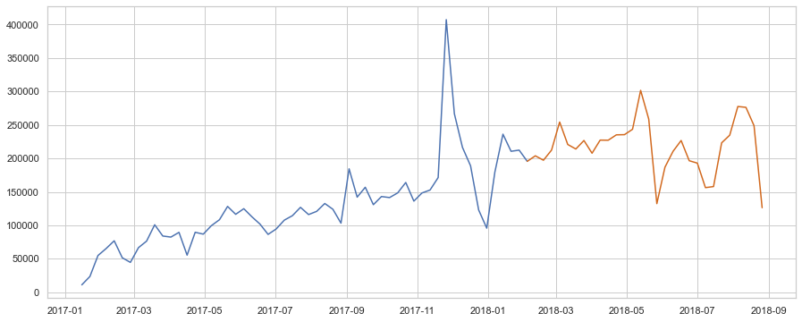
    


```python
autoArimaModel = auto_arima(train, m=12, seazonal=False, 
                            trace=False, random_state=1, n_fits=50)

print(autoArimaModel.summary())
```

                                          SARIMAX Results                                      
    ===========================================================================================
    Dep. Variable:                                   y   No. Observations:                   56
    Model:             SARIMAX(2, 0, 2)x(0, 1, [], 12)   Log Likelihood                -521.620
    Date:                             Fri, 28 Jan 2022   AIC                           1055.240
    Time:                                     13:51:38   BIC                           1065.946
    Sample:                                          0   HQIC                          1059.210
                                                  - 56                                         
    Covariance Type:                               opg                                         
    ==============================================================================
                     coef    std err          z      P>|z|      [0.025      0.975]
    ------------------------------------------------------------------------------
    intercept   3.467e+04   1.55e+04      2.230      0.026    4202.450    6.51e+04
    ar.L1          0.9310      0.330      2.820      0.005       0.284       1.578
    ar.L2         -0.7481      0.312     -2.394      0.017      -1.360      -0.136
    ma.L1         -0.5276      0.295     -1.790      0.073      -1.105       0.050
    ma.L2          0.7242      0.431      1.679      0.093      -0.121       1.570
    sigma2      1.296e+09      0.156   8.32e+09      0.000     1.3e+09     1.3e+09
    ===================================================================================
    Ljung-Box (L1) (Q):                   0.07   Jarque-Bera (JB):               215.08
    Prob(Q):                              0.79   Prob(JB):                         0.00
    Heteroskedasticity (H):               5.63   Skew:                             2.42
    Prob(H) (two-sided):                  0.00   Kurtosis:                        12.69
    ===================================================================================
    
    Warnings:
    [1] Covariance matrix calculated using the outer product of gradients (complex-step).
    [2] Covariance matrix is singular or near-singular, with condition number 7.02e+25. Standard errors may be unstable.
    


```python
dateRange = pd.date_range(dataTimeMean.index[-1], freq='W', periods=13)[1:]

predict = pd.DataFrame(autoArimaModel.predict(n_periods=len(dateRange)), index=dateRange)
predict.columns = ['price']
predict.price = predict.price.round(2)

print('Predições das próximas semanas com auto-Arima')
print("\n")
print((predict.price).to_markdown())
```

    Predições das próximas semanas com auto-Arima
    
    
    |                     |   price |
    |:--------------------|--------:|
    | 2018-09-02 00:00:00 |  198772 |
    | 2018-09-09 00:00:00 |  439179 |
    | 2018-09-16 00:00:00 |  310642 |
    | 2018-09-23 00:00:00 |  268172 |
    | 2018-09-30 00:00:00 |  238908 |
    | 2018-10-07 00:00:00 |  165495 |
    | 2018-10-14 00:00:00 |  132648 |
    | 2018-10-21 00:00:00 |  216692 |
    | 2018-10-28 00:00:00 |  277881 |
    | 2018-11-04 00:00:00 |  256313 |
    | 2018-11-11 00:00:00 |  258352 |
    | 2018-11-18 00:00:00 |  238970 |
    


```python
plt.figure(figsize=(15,5))
plt.ticklabel_format(useOffset=False, style='plain')
plt.plot(train, label = 'Train')
plt.plot(test, label = 'Test')
plt.plot(predict, label = 'Predicão')
plt.title('Predições das próximas semanas com auto-Arima')
plt.legend(loc='best')
plt.show()
```


    
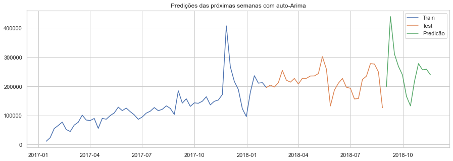
    


### **Conclusão**  
Analisando cada uma das variáveis ​​conseguimos obter insights importantes sobre os clientes do site Olist:  
* Conseguimos prever a receita de vendas para as próximas semanas;
* Poderíamos prever a receita para as próximas semanas, ou meses, apoiando a equipe que definirá as metas.


```python

```
